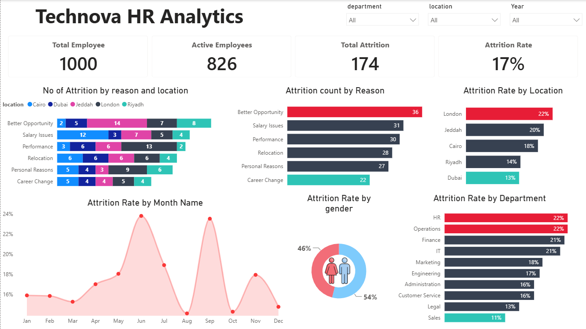
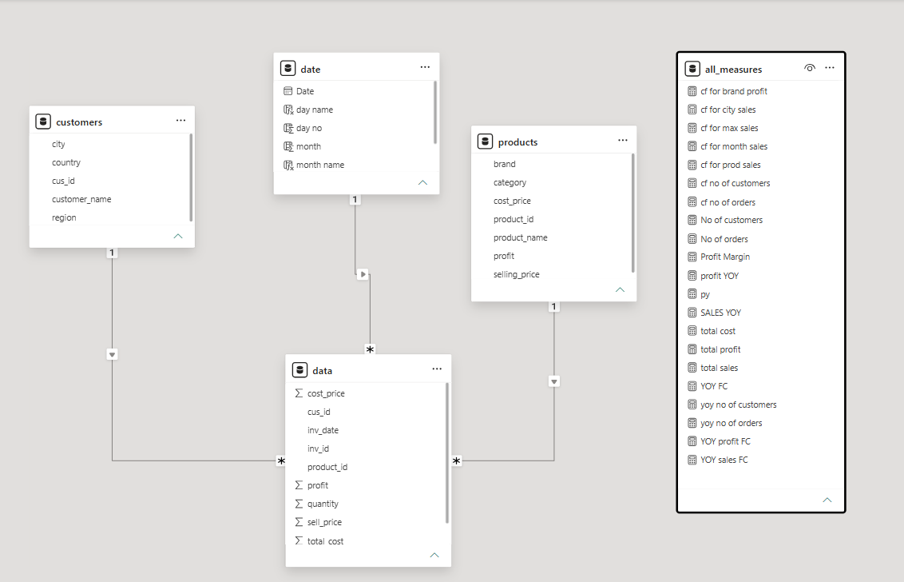

# 👥 Technova HR Analytics Dashboard

An interactive Power BI dashboard analyzing employee performance, compensation, and attrition at a fictional company (Technova) — built on a fully synthetic dataset generated with Python.



## 🔍 Overview

This project simulates a real-world HR analytics scenario, covering the full pipeline from **synthetic data generation** to **data modeling** and **interactive visualization**. It's designed to answer key HR questions: How are we compensating employees? Who's performing well? Where — and why — are we losing people?

## 🐍 Dataset Generation

The entire dataset was **synthetically generated using Python**, with no real employee data involved. Libraries used:

- **`pandas`** — for structuring and manipulating the generated tables
- **`Faker`** — for generating realistic names, dates, and other fake-but-plausible attributes
- **`random`** — for controlled randomization of numeric values, categories, and distributions (salaries, ratings, attrition reasons, etc.)

The result is a relational dataset simulating employee records, salary history, performance reviews, and attrition events across departments, job levels, and locations.

## 🗂️ Data Model

The dataset follows a star-schema-like structure:

| Table | Description |
|---|---|
| `dim_employees` | Core employee dimension — hire date, department, education, job level, gender, etc. |
| `fac_salary` | Salary records — base salary, bonus, increment %, increment category |
| `fac_employees_attrition` | Attrition events — exit date, exit type, reason, years at company |
| `fac_employee_performance` | Performance reviews — KPI score, rating, performance level, comments |
| `Date` | Standard date dimension table (Month, Quarter, Year) |

## 🖥️ Dashboard Pages

### 1. Performance & Compensation
- **Average Base Salary by Job Level** — compensation progression from Entry Level to Manager
- **Avg Increment % by Department** — which departments received the highest raises
- **Average Base Salary by Department**
- **Avg Increment % by Performance Level**
- **Salary vs. KPI Score scatter plot** — correlation between pay and performance across departments

### 2. Attrition Analysis
- **No. of Attrition by Reason and Location** — combo breakdown across cities
- **Attrition Count by Reason** — Better Opportunity, Salary Issues, Performance, Relocation, Personal Reasons, Career Change
- **Attrition Rate by Location, Department, Gender**
- **Attrition Rate by Month** — trend across the year

## 📌 Key Metrics (KPIs)

| Metric | Value |
|---|---|
| Total Employees | 1,000 |
| Active Employees | 826 |
| Total Attrition | 174 |
| Attrition Rate | 17% |
| Average KPI Score | 78.84 |
| Average Base Salary | 13,784 |
| Avg Increment % | 7% |

## 🎛️ Filters / Slicers

- **Department**
- **Location**
- **Year**
  
## 📈 Business Insights

- Managers receive nearly 2× the average salary of Entry Level employees.
- Finance has the highest average salary increment (7.03%).
- Better Opportunity is the leading attrition reason.
- London shows the highest attrition rate (22%).
- Average KPI scores remain relatively consistent across departments despite salary differences.

  ## ✨ Features

- Interactive slicers
- Dynamic DAX measures
- Cross-filtering
- Custom Date Table
- Star Schema data model
- Synthetic dataset generated in Python

  ## 🗃️ Data Model




## 🛠️ Tools Used

- **Python** (`pandas`, `Faker`, `random`) — synthetic data generation
- **Power BI Desktop** — data modeling, DAX measures, and visualization
- **DAX** — for KPI calculations and cross-table analysis

## 📂 Repository Contents

```
technova-hr-analytics/
├── README.md
├── dashboard.pbix              # Power BI project file
├── data_generation.py          # Python script for synthetic dataset generation
├── images/                     # Dashboard screenshots
│   ├── dashboard-overview.png
│   └── dashboard-attrition.png
└── data/                       # Generated CSV datasets
    ├── dim_employees.csv
    ├── fac_salary.csv
    ├── fac_employees_attrition.csv
    └── fac_employee_performance.csv
```

## 🚀 How to View

1. Clone or download this repository.
2. Open `dashboard.pbix` using [Power BI Desktop](https://powerbi.microsoft.com/desktop/) (free download).
3. Explore the dashboard using the interactive filters.

> Don't have Power BI installed? Check the `images/` folder for full dashboard screenshots.

## ⚠️ Disclaimer

All data in this project is **100% synthetic** and randomly generated for portfolio/demonstration purposes. It does not represent any real company, employees, or HR records.

## 📬 Contact

Feel free to reach out with questions or feedback about this project.

---
⭐ If you found this project useful, consider giving the repo a star!
